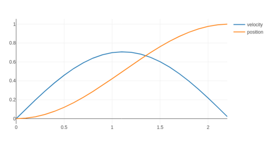
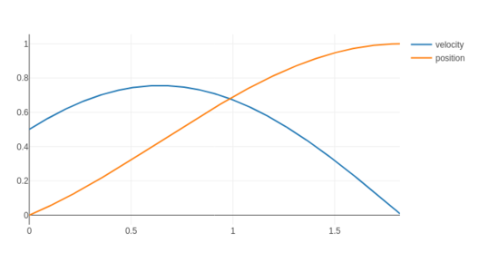
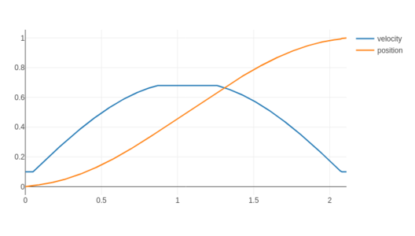

# node-smove
Smove is a library for producing human-like sinusoidal motion based on work by
Joseph Sullivan.

## Example usage

### 1. Simple movement

    const Smove = require('smove');
    const s = new Smove({ xf: 1.0, a: 1.0 });
    console.log(s.sample(0.01));

### 2. Starting velocity

    const Smove = require('smove');
    const s = new Smove({ xf: 1.0, a: 1.0, v0: 0.5 });
    console.log(s.sample(0.01));

### 3. Velocity limits

    const Smove = require('smove');
    const s = new Smove({ xf: 1.0, a: 1.0, v_min: 0.1, v_max: 0.68 });
    console.log(s.sample(0.01));

